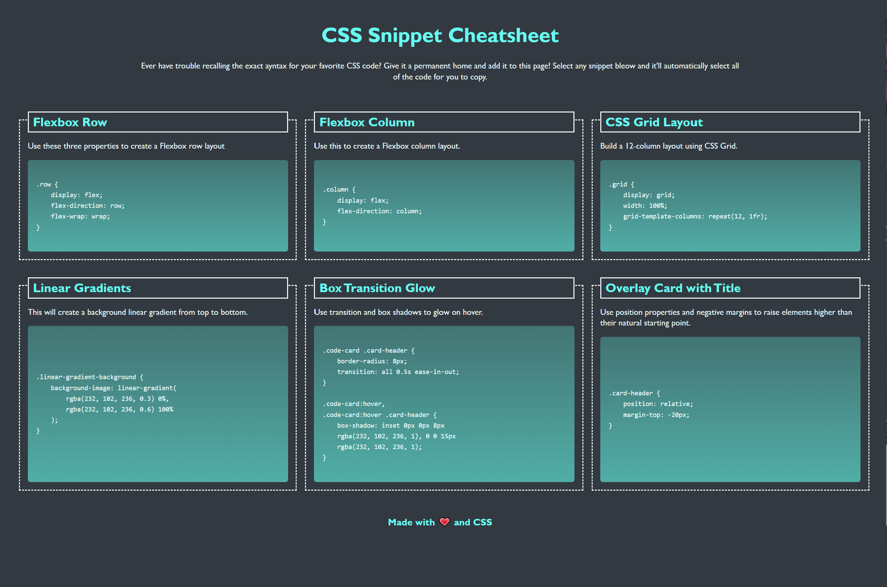

# CSS Snippet Cheatsheet

## Description
This project is a simple semantic HTML web page style with CSS. It aims to to practice and showcase CSS abilities, including layout design, user-select and transition property, linear-gradient function, and responsive design.

## Folder Structure

- **index.html**: The Main HTML file for CSS Snippet Cheatsheet.
- **css:** css file for styling.
- **img:** Screenshots for the HTML file.
- **README.md:** This file.

## Links
[Visit my application](https://celia103.github.io/CSS-Snippet-Cheatsheet/)

[Visit the GitHub repository](https://github.com/celia103/CSS-Snippet-Cheatsheet)

Application Screenshot:

Application Screenshot with effect:

## License
MIT License
